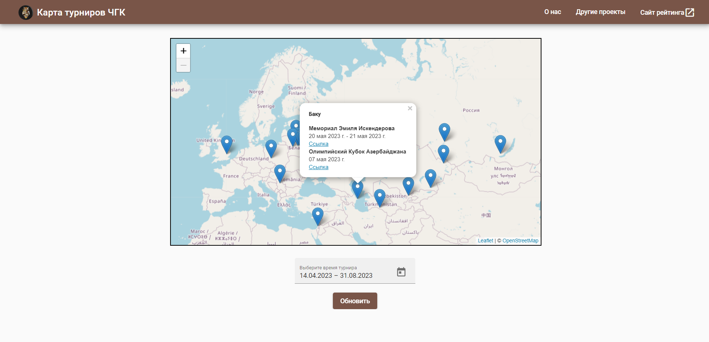

# Карта турниров по интеллектуальным играм

Карта турниров ЧГК - сервис, отображающий на карте города, в которых будут проводиться очные турниры ЧГК. Можно установить фильтр по дате. Так как работа сервиса основана на выгрузке данных с сайта рейтинга, отображаются только турниры, которые внесены туда заранее.

Сайт состоит из двух частей:

Фронтенд написан на Angular

Запуск `ng serve --open`

Бэкенд написан на Express JS

Запуск `npm start`

### Благодарности
Создателям бесплатных open-source фреймворков и библиотек:

[Node JS](https://nodejs.org/) - основа всего проекта

[Express JS](https://expressjs.com/) - бэкенд

[Angular](https://angular.io/)</a> - фронтенд

[Leaflet](https://leafletjs.com/) - интерактивная карта

[OpenStreetMap](https://www.openstreetmap.org/) - базовая карта

[Админам сайта рейтинга](https://rating.chgk.info/) за API

